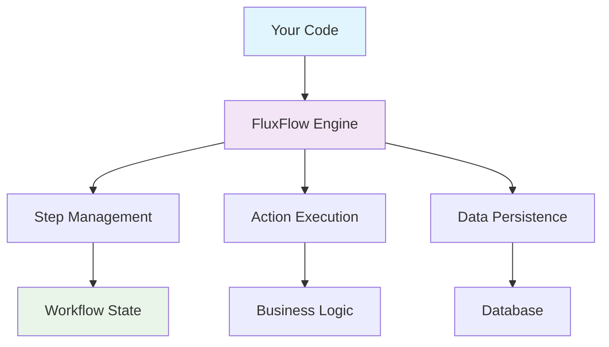

<div align="center">


# FluxFlow
**Code-First Workflow Engine for Modern Applications**

[](https://search.maven.org/search?q=g:%22de.lise.fluxflow%22%20AND%20a:%22springboot%22)
[](https://opensource.org/licenses/Apache-2.0) 
[](https://build.lise.de/job/Hessen%20Mobil/job/fluxflow/job/develop/)
[](https://kotlinlang.org)
[](https://openjdk.org)
[](https://spring.io/projects/spring-boot)

</div>

---

## 🎯 What is FluxFlow?

FluxFlow is a **lightweight, developer-friendly workflow engine** that revolutionizes how you build and manage business processes. Instead of wrestling with XML configurations or visual designers, you define workflows directly in your **Java or Kotlin code** – making them testable, maintainable, and type-safe.

### 💡 The FluxFlow Philosophy

> **Your code IS your workflow.**  
> Transform your Java/Kotlin classes into powerful workflow steps, where properties become state and methods define transitions.

Unlike traditional BPMN engines that scatter logic across multiple artifacts, FluxFlow consolidates everything in your domain code. This means:
- ✅ **No XML hell** – Pure code-based workflows
- ✅ **Type safety** – Compile-time verification of your workflows  
- ✅ **Easy testing** – Unit test your business logic naturally
- ✅ **Version control friendly** – Track changes like any other code
- ✅ **IDE support** – Full autocomplete, refactoring, and debugging

## 🚀 Why Choose FluxFlow?

| **Traditional BPMN** | **FluxFlow** |
|----------------------|--------------|
| 🔴 XML configuration files | 🟢 Pure Java/Kotlin code |
| 🔴 Separated business logic | 🟢 Unified codebase |
| 🔴 Hard to test | 🟢 Easy unit testing |
| 🔴 Designer dependency | 🟢 IDE-native development |
| 🔴 Runtime errors | 🟢 Compile-time safety |
| 🔴 Complex debugging | 🟢 Standard debugging tools |

## ✨ Key Features

<details>
<summary><strong>🏗️ Code-First Architecture</strong></summary>

- **Step Classes**: Your POJOs become workflow steps
- **State Management**: Properties hold step-specific data
- **Action Methods**: Methods define transitions and business logic
- **Type Safety**: Compile-time verification of workflow structure
</details>

<details>
<summary><strong>🔄 Workflow Components</strong></summary>

- **Workflow Data**: Shared information across the entire workflow
- **Step Data**: Step-specific state that can be queried and updated
- **Step Actions**: Transitions and business logic execution
- **Jobs**: Scheduled automatic execution (powered by Quartz)
- **Validation**: Built-in Jakarta Bean Validation support
</details>

<details>
<summary><strong>🌱 Spring Boot Integration</strong></summary>

- **Dependency Injection**: Full Spring context support
- **Auto-Configuration**: Zero-configuration setup
- **Persistence**: Automatic workflow state management
- **Testing**: Comprehensive test utilities
- **Monitoring**: Built-in metrics and health checks
</details>

<details>
<summary><strong>🧪 Testing & Quality</strong></summary>

- **Unit Testing**: Test workflow logic like any other code
- **Mocking Support**: Easy step and action mocking
- **Test Utilities**: Specialized testing framework
- **Coverage**: Full code coverage for workflows
</details>

## 🔥 Quick Example

Transform this simple business process into executable code:

```kotlin
// 1️⃣ Create a workflow step
@Step
class CreateVacationRequestStep(
    var employee: String = "",      // Step data
    var startDate: Instant = Instant.now(),
    var endDate: Instant = Instant.now(),
    var reason: String = ""
) {
    // 2️⃣ Define transitions with actions
    @Action
    fun submit(): ReviewVacationStep {
        // Business logic here
        return ReviewVacationStep(
            employee = employee,
            startDate = startDate,
            endDate = endDate,
            reason = reason
        )
    }
    
    @Action
    fun cancel(): Continuation<Unit> {
        // Workflow ends here
        return Continuation.end()
    }
}

@Step  
class ReviewVacationStep(
    val employee: String,
    val startDate: Instant,
    val endDate: Instant,
    val reason: String
) {
    @Data var reviewerNotes: String = ""
    @Data var approved: Boolean = false
    
    @Action
    fun approve(): NotifyApprovalStep {
        approved = true
        return NotifyApprovalStep(employee, startDate, endDate)
    }
    
    @Action  
    fun reject(): NotifyRejectionStep {
        approved = false
        return NotifyRejectionStep(employee, reason, reviewerNotes)
    }
}
```

That's it! You now have a **fully functional workflow** with:
- ✅ Type-safe state management
- ✅ Clear transition logic  
- ✅ Easy unit testing
- ✅ Automatic persistence (with Spring Boot)

## 📊 Workflow Visualization

<div align="center">


*Example workflow showing step transitions and data flow*

</div>

## 🎪 Real-World Use Cases

FluxFlow excels in various business scenarios:

<table>
<tr>
<td width="50%">

**🏢 Enterprise Workflows**
- Employee onboarding/offboarding
- Approval processes  
- Document workflows
- Compliance procedures

**💰 Financial Services**  
- Loan application processing
- KYC/AML workflows
- Trade settlement
- Risk assessment flows

</td>
<td width="50%">

**🛒 E-Commerce**
- Order fulfillment  
- Return processing
- Inventory management
- Customer service tickets

**🏥 Healthcare**
- Patient intake processes
- Medical record workflows  
- Insurance claim processing
- Treatment approval flows

</td>
</tr>
</table>

## ⚡ Quick Start

### 1️⃣ Add FluxFlow to your project

<details>
<summary><strong>Gradle (Kotlin DSL)</strong></summary>

```kotlin
dependencies {
    implementation("de.lise.fluxflow:springboot:0.2.0")
    implementation("de.lise.fluxflow:mongo:0.2.0") // For MongoDB persistence
}
```
</details>

<details>
<summary><strong>Gradle (Groovy)</strong></summary>

```gradle
dependencies {
    implementation 'de.lise.fluxflow:springboot:0.2.0'
    implementation 'de.lise.fluxflow:mongo:0.2.0' // For MongoDB persistence
}
```
</details>

<details>
<summary><strong>Maven</strong></summary>

```xml
<dependency>
    <groupId>de.lise.fluxflow</groupId>
    <artifactId>springboot</artifactId>
    <version>0.2.0</version>
</dependency>
<dependency>
    <groupId>de.lise.fluxflow</groupId>
    <artifactId>mongo</artifactId>
    <version>0.2.0</version>
</dependency>
```
</details>

### 2️⃣ Create your first workflow step

```java
// Java Example
@Step
public class OrderProcessingStep {
    @Data private String orderId;
    @Data private BigDecimal amount;
    @Data private String customerId;
    
    @Action
    public PaymentStep processPayment() {
        // Your business logic here
        return new PaymentStep(orderId, amount);
    }
    
    @Action 
    public Continuation<Void> cancelOrder() {
        // Cancel logic here
        return Continuation.end();
    }
}
```

### 3️⃣ Configure Spring Boot

```kotlin
@SpringBootApplication
@EnableFluxFlow
class MyApplication

fun main(args: Array<String>) {
    runApplication<MyApplication>(*args)
}
```

### 4️⃣ Start your workflow

```kotlin
@RestController
class WorkflowController(
    private val workflowEngine: WorkflowEngine
) {
    @PostMapping("/orders")
    fun createOrder(@RequestBody order: Order): String {
        val workflow = workflowEngine.start(
            OrderProcessingStep().apply {
                orderId = order.id
                amount = order.total
                customerId = order.customerId
            }
        )
        return workflow.id
    }
}
```

## 🏗️ Architecture Overview



## 📋 Core Concepts

| **Concept** | **Description** | **Example** |
|-------------|-----------------|-------------|
| **🔄 Workflow** | A complete business process | Order fulfillment process |
| **📦 Step** | Individual stage in workflow | "Payment Processing" step |
| **💾 Step Data** | State specific to a step | Payment amount, customer ID |
| **⚡ Action** | Transition between steps | `processPayment()` method |
| **🗄️ Workflow Data** | Shared data across all steps | Order ID, customer info |
| **⏰ Jobs** | Scheduled automatic actions | Send reminder after 24h |

## 🔗 Resources & Links

<div align="center">

| Resource | Link |
|----------|------|
| 📖 **Documentation** | [docs.fluxflow.cloud](https://docs.fluxflow.cloud) |
| 🚀 **Getting Started** | [Quick Start Guide](https://docs.fluxflow.cloud/en/latest/getting-started/getting-started/) |
| 📦 **Maven Central** | [Browse Packages](https://search.maven.org/search?q=g:de.lise.fluxflow) |  
| 📝 **Changelog** | [Release Notes](CHANGELOG.md) |
| 🤝 **Contributing** | [Contribution Guide](CONTRIBUTING.md) |
| 🔒 **Security** | [Security Policy](SECURITY.md) |

</div>

## ❓ Frequently Asked Questions

<details>
<summary><strong>How does FluxFlow compare to traditional BPMN engines?</strong></summary>

FluxFlow takes a code-first approach rather than model-first. Instead of designing workflows in visual tools and then implementing the logic separately, you write your workflows directly in Java/Kotlin. This eliminates the gap between design and implementation, makes testing easier, and leverages your existing development tools.
</details>

<details>
<summary><strong>Can I use FluxFlow without Spring Boot?</strong></summary>

Yes! While FluxFlow has excellent Spring Boot integration, the core engine is framework-agnostic. You can use it with other frameworks or in standalone applications by manually configuring the workflow engine components.
</details>

<details>
<summary><strong>What persistence options are available?</strong></summary>

FluxFlow supports multiple persistence backends including MongoDB, SQL databases (via JPA), and in-memory storage for testing. The persistence layer is pluggable, so you can implement custom storage backends if needed.
</details>

<details>
<summary><strong>How do I handle long-running workflows?</strong></summary>

FluxFlow automatically persists workflow state between steps. Long-running workflows can be paused and resumed, and the engine handles scheduling of future actions through integration with Quartz Scheduler.
</details>

<details>
<summary><strong>Is FluxFlow production-ready?</strong></summary>

Yes! FluxFlow is actively used in production environments. It includes comprehensive monitoring, metrics, error handling, and has been battle-tested in enterprise applications.
</details>

## 🚧 Compatibility

| Component | Version | Support |
|-----------|---------|---------|
| **Java** | 17+ | ✅ Full Support |
| **Kotlin** | 2.0+ | ✅ Full Support |
| **Spring Boot** | 3.0+ | ✅ Full Support |
| **Jakarta EE** | 9+ | ✅ Full Support |

## 🤝 Community & Support

<div align="center">

**Found a bug?** [Report it](https://github.com/lisegmbh/fluxflow/issues/new)  
**Have a question?** [Start a discussion](https://github.com/lisegmbh/fluxflow/discussions)  
**Want to contribute?** [Read our guide](CONTRIBUTING.md)

---

**🌟 If FluxFlow helps your project, please consider giving us a star!**

[⭐ Star on GitHub](https://github.com/lisegmbh/fluxflow) | [🐦 Follow on Twitter](https://twitter.com/LiseGmbH)

</div>

## 👥 Contributors

We're grateful to these wonderful people who have contributed to FluxFlow:

- [Christian Scholz](https://github.com/bobmazy) - Core Architecture & Development
- [Dominik "Pipo" Alexander](https://github.com/DerPipo) - Framework Integration
- [Jagadish Singh](https://github.com/jagadish-singh-lise) - Testing & Quality Assurance  
- [Marcel Singer](https://github.com/masinger) - Core Engine Development
- [Ömer Ciblak](https://github.com/oemer-ciblak) - Documentation & Examples

---

<div align="center">

**Built with ❤️ by [Lise GmbH](https://www.lise.de)**

*FluxFlow is open source software licensed under the [Apache License 2.0](LICENSE)*

</div>
