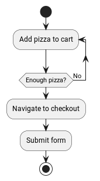

<div align="center">


# FluxFlow
**Code-First Workflow Engine for Modern Applications**

[](https://search.maven.org/search?q=g:%22de.lise.fluxflow%22%20AND%20a:%22springboot-spring3%22)
[](https://opensource.org/licenses/Apache-2.0)
[](https://build.lise.de/job/Hessen%20Mobil/job/fluxflow/job/develop/)
[](https://kotlinlang.org)
[](https://openjdk.org)
[](https://spring.io/projects/spring-boot)

</div>

---

## 📚 Table of Contents

- [🎯 What is FluxFlow?](#-what-is-fluxflow)
- [🚀 Why Choose FluxFlow?](#-why-choose-fluxflow)
- [✨ Key Features](#-key-features)
- [🔥 Quick Example](#-quick-example)
- [📊 Workflow Visualization](#-workflow-visualization)
- [💡 Example Use Cases](#-example-use-cases)
- [⚡ Quick Start](#-quick-start)
- [🏗️ Architecture Overview](#️-architecture-overview)
- [📋 Core Concepts](#-core-concepts)
- [🔗 Resources & Links](#-resources--links)
- [❓ Frequently Asked Questions](#-frequently-asked-questions)
- [🚧 Compatibility](#-compatibility)
- [🤝 Community & Support](#-community--support)
- [👥 Contributors](#-contributors)

---

## 🎯 What is FluxFlow?

FluxFlow is a **lightweight, developer-friendly workflow engine** that transforms how you build and manage business processes.
Instead of wrestling with XML configurations or visual designers, you define workflows directly in your **Java or Kotlin code** – making them testable, maintainable, and type-safe.

### 💡 The FluxFlow Philosophy

> **Your code IS your workflow.**  
> Transform your Java/Kotlin classes into powerful workflow steps, where properties become state and methods define transitions.

Unlike traditional BPMN engines that scatter logic across multiple artifacts, FluxFlow consolidates everything in your domain code.
This means:
- ✅ **No XML hell** – Pure code-based workflows
- ✅ **Type safety** – Compile-time verification of your workflows
- ✅ **Easy testing** – Unit test your business logic naturally
- ✅ **Version control friendly** – Track changes like any other code
- ✅ **IDE support** – Full autocomplete, refactoring, and debugging

## 🚀 Why Choose FluxFlow?

| **Traditional BPMN** | **FluxFlow** |
|----------------------|--------------|
| 🔴 XML configuration files | 🟢 Pure Java/Kotlin code |
| 🔴 Separated business logic | 🟢 Unified codebase |
| 🔴 Hard to test | 🟢 Easy unit testing |
| 🔴 Designer dependency | 🟢 IDE-native development |
| 🔴 Runtime errors | 🟢 Compile-time safety |
| 🔴 Complex debugging | 🟢 Standard debugging tools |

## ✨ Key Features

<details>
<summary><strong>🏗️ Code-First Architecture</strong></summary>

- **Step Classes**: Your POJOs become workflow steps
- **State Management**: Properties hold step-specific data
- **Action Methods**: Methods define transitions and business logic
- **Type Safety**: Compile-time verification of workflow structure
</details>

<details>
<summary><strong>🔄 Workflow Components</strong></summary>

- **Workflow Data**: Shared information across the entire workflow
- **Step Data**: Step-specific state that can be queried and updated
- **Step Actions**: Transitions and business logic execution
- **Jobs**: Scheduled automatic execution (powered by Quartz)
- **Validation**: Built-in Jakarta Bean Validation support
</details>

<details>
<summary><strong>🌱 Spring Boot Integration</strong></summary>

- **Dependency Injection**: Full Spring context support
- **Auto-Configuration**: Zero-configuration setup
- **Persistence**: Automatic workflow state management
- **Testing**: Comprehensive test utilities
- **Monitoring**: Built-in metrics and health checks
</details>

<details>
<summary><strong>🧪 Testing & Quality</strong></summary>

- **Unit Testing**: Test workflow logic like any other code
- **Mocking Support**: Easy step and action mocking
- **Test Utilities**: Specialized testing framework
- **Coverage**: Full code coverage for workflows
</details>

## 🔥 Quick Example

Transform this pizza ordering process into executable code:

**1. Add FluxFlow to your project:**

> **Spring Boot 3:** Use Maven coordinates ending in `-spring3` (for example `springboot-spring3`, `springboot-mongo-spring3`). Coordinates without that suffix (such as `springboot` or `mongo`) are **legacy**: they remain for older releases only and do **not** receive new versions.

> **Dependency alignment:** Use your application’s **Spring Boot BOM** (for example `spring-boot-starter-parent` in Maven, or `platform("org.springframework.boot:spring-boot-dependencies:…")` in Gradle) so versions of libraries that Boot manages (Jackson, Jakarta Servlet, SLF4J, and similar) stay consistent with your chosen Boot release. FluxFlow’s published POMs import `spring-boot-dependencies` for that alignment and do not declare explicit versions for those coordinates in the dependency graph.

<details>
<summary><strong>Gradle (Kotlin DSL)</strong></summary>

```kotlin
dependencies {
    implementation("de.lise.fluxflow:springboot-spring3:0.3.0")
    implementation("de.lise.fluxflow:springboot-mongo-spring3:0.3.0") // For MongoDB persistence
}
```
</details>

<details>
<summary><strong>Gradle (Groovy)</strong></summary>

```gradle
dependencies {
    implementation 'de.lise.fluxflow:springboot-spring3:0.3.0'
    implementation 'de.lise.fluxflow:springboot-mongo-spring3:0.3.0' // For MongoDB persistence
}
```
</details>

<details>
<summary><strong>Maven</strong></summary>

```xml
<dependency>
    <groupId>de.lise.fluxflow</groupId>
    <artifactId>springboot-spring3</artifactId>
    <version>0.3.0</version>
</dependency>
<dependency>
    <groupId>de.lise.fluxflow</groupId>
    <artifactId>springboot-mongo-spring3</artifactId>
    <version>0.3.0</version>
</dependency>
```
</details>

**2. Define your workflow steps:**

```kotlin
// 1️⃣ Add Pizza to Cart Step
@Step
class AddPizzaToCartStep(
    @Data 
    @NotEmpty(message = "Cart cannot be empty. Please add at least one pizza before checkout.")
    var pizzas: MutableList<Pizza> = mutableListOf()
) {
    @Action(beforeExecutionValidation = ValidationBehavior.AllowInvalid)
    fun addPizza(pizza: Pizza): AddPizzaToCartStep {
        // Add the pizza to cart
        pizzas.add(pizza)
        // Return to same step for more pizzas
        return AddPizzaToCartStep(pizzas)
    }
    
    @Action
    fun toCheckout(): CheckoutStep {
        // Calculate total and proceed to checkout with current pizzas
        val total = pizzas.sumOf { it.price }
        return CheckoutStep(pizzas, total)
    }
}

// 2️⃣ Checkout Step
@Step
class CheckoutStep(
    @Data val pizzas: List<Pizza>,
    @Data val total: BigDecimal
) {
    @Data var deliveryAddress: String = ""
    @Data var paymentMethod: String = ""
    
    @Action
    fun submitOrder(): Continuation<OrderConfirmation> {
        // Process order with pre-calculated total
        val confirmation = OrderConfirmation(
            orderId = UUID.randomUUID().toString(),
            pizzas = pizzas,
            total = total,
            deliveryAddress = deliveryAddress
        )
        
        // Workflow completes successfully
        return Continuation.end(confirmation)
    }
}

data class Pizza(val name: String, val price: BigDecimal)
data class OrderConfirmation(
    val orderId: String,
    val pizzas: List<Pizza>,
    val total: BigDecimal,
    val deliveryAddress: String
)
```

**3. Test your workflow logic:**

```kotlin
class PizzaOrderWorkflowTest {
    
    @Test
    fun `addPizza should add pizza to cart and return to same step`() {
        // Arrange
        val initialStep = AddPizzaToCartStep()
        val pizza = Pizza("Margherita", BigDecimal("12.99"))
        
        // Act
        val result = initialStep.addPizza(pizza)
        
        // Assert
        assertThat(result.pizzas).hasSize(1)
        assertThat(result.pizzas[0]).isEqualTo(pizza)
        assertThat(result).isInstanceOf(AddPizzaToCartStep::class.java)
    }
    
    @Test
    fun `toCheckout should transition to checkout step with current pizzas`() {
        // Arrange
        val pizzas = mutableListOf(
            Pizza("Margherita", BigDecimal("12.99")),
            Pizza("Pepperoni", BigDecimal("14.99"))
        )
        val step = AddPizzaToCartStep(pizzas)
        
        // Act
        val result = step.toCheckout()
        
        // Assert
        assertThat(result).isInstanceOf(CheckoutStep::class.java)
        assertThat(result.pizzas).hasSize(2)
        assertThat(result.total).isEqualTo(BigDecimal("27.98"))
    }
    
    @Test
    fun `submitOrder should create confirmation with pre-calculated total`() {
        // Arrange
        val pizzas = listOf(
            Pizza("Margherita", BigDecimal("12.99")),
            Pizza("Pepperoni", BigDecimal("14.99"))
        )
        val checkoutStep = CheckoutStep(pizzas, BigDecimal("27.98")).apply {
            deliveryAddress = "123 Main St"
            paymentMethod = "Credit Card"
        }
        
        // Act
        val result = checkoutStep.submitOrder()
        
        // Assert
        assertThat(result.isCompleted).isTrue()
        val confirmation = result.completionData as OrderConfirmation
        assertThat(confirmation.pizzas).isEqualTo(pizzas)
        assertThat(confirmation.total).isEqualTo(BigDecimal("27.98"))
        assertThat(confirmation.deliveryAddress).isEqualTo("123 Main St")
        assertThat(confirmation.orderId).isNotBlank()
    }
}
```

That's it!
You now have a **fully functional pizza ordering workflow** with:
- ✅ Type-safe state management
- ✅ Decision logic with looping
- ✅ Built-in validation rules
- ✅ Comprehensive unit tests
- ✅ Automatic persistence (with Spring Boot)

## 📊 Workflow Visualization

<div align="center">



*Pizza ordering workflow: Add Pizza (addPizza/toCheckout actions) → Checkout → Submit*

</div>

## 💡 Example Use Cases

FluxFlow is well-suited for various business scenarios:

<table>
<tr>
<td width="50%">

**🏢 Enterprise Applications**
- Employee onboarding/offboarding
- Approval processes
- Document workflows
- Compliance procedures

**💰 Financial Processing**
- Loan application processing
- KYC/AML workflows
- Trade settlement
- Risk assessment flows

</td>
<td width="50%">

**🛒 E-Commerce Applications**
- Order fulfillment
- Return processing
- Inventory management
- Customer service tickets

**🏥 Healthcare Systems**
- Patient intake processes
- Medical record workflows
- Insurance claim processing
- Treatment approval flows

</td>
</tr>
</table>

## ⚡ Quick Start

### 1️⃣ Add FluxFlow to your project

> **Spring Boot 3:** Use Maven coordinates ending in `-spring3` (for example `springboot-spring3`, `springboot-mongo-spring3`). Coordinates without that suffix (such as `springboot` or `mongo`) are **legacy**: they remain for older releases only and do **not** receive new versions.

> **Dependency alignment:** Use your application’s **Spring Boot BOM** (for example `spring-boot-starter-parent` in Maven, or `platform("org.springframework.boot:spring-boot-dependencies:…")` in Gradle) so versions of libraries that Boot manages (Jackson, Jakarta Servlet, SLF4J, and similar) stay consistent with your chosen Boot release. FluxFlow’s published POMs import `spring-boot-dependencies` for that alignment and do not declare explicit versions for those coordinates in the dependency graph.

<details>
<summary><strong>Gradle (Kotlin DSL)</strong></summary>

```kotlin
dependencies {
    implementation("de.lise.fluxflow:springboot-spring3:0.3.0")
    implementation("de.lise.fluxflow:springboot-mongo-spring3:0.3.0") // For MongoDB persistence
}
```
</details>

<details>
<summary><strong>Gradle (Groovy)</strong></summary>

```gradle
dependencies {
    implementation 'de.lise.fluxflow:springboot-spring3:0.3.0'
    implementation 'de.lise.fluxflow:springboot-mongo-spring3:0.3.0' // For MongoDB persistence
}
```
</details>

<details>
<summary><strong>Maven</strong></summary>

```xml
<dependency>
    <groupId>de.lise.fluxflow</groupId>
    <artifactId>springboot-spring3</artifactId>
    <version>0.3.0</version>
</dependency>
<dependency>
    <groupId>de.lise.fluxflow</groupId>
    <artifactId>springboot-mongo-spring3</artifactId>
    <version>0.3.0</version>
</dependency>
```
</details>

### 2️⃣ Create your first workflow step

```java
// Java Example - Pizza Ordering Step
@Step
public class AddPizzaToCartStep {
    @Data 
    @NotEmpty(message = "Cart cannot be empty. Please add at least one pizza before checkout.")
    private List<Pizza> pizzas = new ArrayList<>();
    
    @Action(beforeExecutionValidation = ValidationBehavior.AllowInvalid)
    public AddPizzaToCartStep addPizza(Pizza pizza) {
        // Add pizza to cart
        pizzas.add(pizza);
        return new AddPizzaToCartStep(pizzas);
    }
    
    @Action 
    public CheckoutStep toCheckout() {
        // Calculate total and proceed to checkout
        BigDecimal total = pizzas.stream()
            .map(Pizza::getPrice)
            .reduce(BigDecimal.ZERO, BigDecimal::add);
        return new CheckoutStep(pizzas, total);
    }
}
```

### 3️⃣ Configure Spring Boot

```kotlin
@SpringBootApplication
@EnableFluxFlow
class MyApplication

fun main(args: Array<String>) {
    runApplication<MyApplication>(*args)
}
```

### 4️⃣ Start your workflow

```kotlin
@RestController
class PizzaOrderController(
    private val workflowEngine: WorkflowEngine
) {
    @PostMapping("/pizza-orders")
    fun startPizzaOrder(): String {
        val workflow = workflowEngine.start(AddPizzaToCartStep())
        return workflow.id
    }
}
```

## 🏗️ Architecture Overview

FluxFlow follows a simple, layered architecture:

- **🔧 Your Application Code**: Define workflow steps as regular Java/Kotlin classes
- **⚙️ FluxFlow Engine**: Manages workflow execution, state transitions, and persistence
- **💾 Persistence Layer**: Stores workflow state (MongoDB, in-memory, or custom implementations)
- **📅 Scheduling**: Optional Quartz integration for time-based workflow actions
- **🌱 Spring Integration**: Auto-configuration and dependency injection support

## 📋 Core Concepts

| **Concept** | **Description** | **Example** |
|-------------|-----------------|-------------|
| **🔄 Workflow** | A complete business process | Pizza ordering process |
| **📦 Step** | Individual stage in workflow | "Add Pizza to Cart" step |
| **💾 Step Data** | State specific to a step | Pizza list, customer ID |
| **⚡ Action** | Transition between steps | `addPizza()` method |
| **🗄️ Workflow Data** | Shared data across all steps | Customer info, order ID |
| **⏰ Jobs** | Scheduled automatic actions | Send reminder after 30min |

## 🔗 Resources & Links

<div align="center">

| Resource | Link |
|----------|------|
| 📖 **Documentation** | [docs.fluxflow.cloud](https://docs.fluxflow.cloud) |
| 🚀 **Getting Started** | [Quick Start Guide](https://docs.fluxflow.cloud/en/latest/getting-started/getting-started/) |
| 📦 **Maven Central** | [Browse Packages](https://search.maven.org/search?q=g:de.lise.fluxflow) |  
| 📝 **Changelog** | [Release Notes](CHANGELOG.md) |
| 🤝 **Contributing** | [Contribution Guide](CONTRIBUTING.md) |
| 🔒 **Security** | [Security Policy](SECURITY.md) |

</div>

## ❓ Frequently Asked Questions

<details>
<summary><strong>How does FluxFlow compare to traditional BPMN engines?</strong></summary>

FluxFlow takes a code-first approach rather than model-first.
Instead of designing workflows in visual tools and then implementing the logic separately, you write your workflows directly in Java/Kotlin.
This eliminates the gap between design and implementation, makes testing easier, and leverages your existing development tools.
</details>

<details>
<summary><strong>Can I use FluxFlow without Spring Boot?</strong></summary>

Yes!
While FluxFlow has excellent Spring Boot integration, the core engine is framework-agnostic.
You can use it with other frameworks or in standalone applications by manually configuring the workflow engine components.
</details>

<details>
<summary><strong>What persistence options are available?</strong></summary>

FluxFlow supports multiple persistence backends including MongoDB and in-memory storage for testing.
The persistence layer is pluggable, so you can implement custom storage backends if needed.
</details>

<details>
<summary><strong>How do I handle long-running workflows?</strong></summary>

FluxFlow automatically persists workflow state between steps.
Long-running workflows can be paused and resumed, and the engine handles scheduling of future actions through integration with Quartz Scheduler.
</details>

<details>
<summary><strong>Is FluxFlow production-ready?</strong></summary>

Yes!
FluxFlow is actively used in production environments.
It includes comprehensive monitoring, metrics, error handling, and has been battle-tested in enterprise applications.
</details>

## 🚧 Compatibility

| Component | Version | Support |
|-----------|---------|---------|
| **Java** | 17+ | ✅ Full Support |
| **Kotlin** | 2.0+ | ✅ Full Support |
| **Spring Boot** | 3.0+ | ✅ Full Support |
| **Jakarta EE** | 9+ | ✅ Full Support |

Spring Boot applications should keep using their Boot BOM for third-party versions. FluxFlow Spring integration artifacts are built against the same model so your BOM—not FluxFlow—remains the source of truth for aligned dependency versions.

## 🤝 Community & Support

<div align="center">

**Found a bug?** [Report it](https://github.com/lisegmbh/fluxflow/issues/new)  
**Have a question?** [Start a discussion](https://github.com/lisegmbh/fluxflow/discussions)  
**Want to contribute?** [Read our guide](CONTRIBUTING.md)

---

**🌟 If FluxFlow helps your project, please consider giving us a star!**

[⭐ Star on GitHub](https://github.com/lisegmbh/fluxflow) | [🐦 Follow on Twitter](https://twitter.com/LiseGmbH)

</div>

## 👥 Contributors

We're grateful to these wonderful people who have contributed to FluxFlow:

- [Christian Scholz](https://github.com/bobmazy)
- [Dominik "Pipo" Alexander](https://github.com/DerPipo)
- [Marcel Singer](https://github.com/masinger)

**In Memory:**
- [Jagadish Singh](https://github.com/jagadish-singh-lise) - We deeply appreciate his valuable contributions to both FluxFlow and our team

---

<div align="center">

**Built with ❤️ by [Lise GmbH](https://www.lise.de)**

*FluxFlow is open source software licensed under the [Apache License 2.0](LICENSE)*

</div>