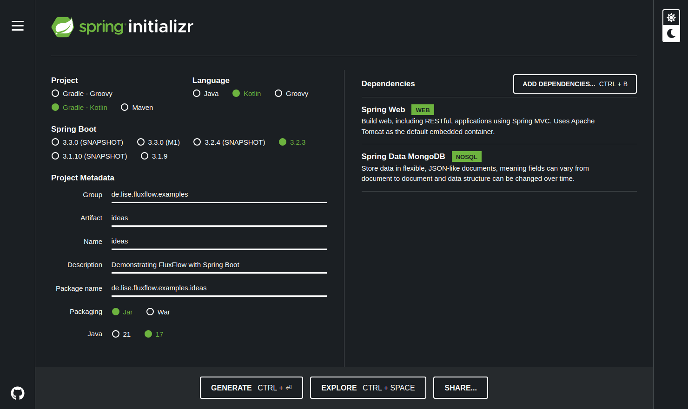

# Getting started

## Project setup
During this demonstration, we are going to use the following setup:
- Spring Boot service written in Kotlin
- A dockerized MongoDB instance for persistence
- FluxFlow as our workflow engine

### 1. Initializing a Spring Boot project
You can also download the Spring Boot project template using [this link](https://start.spring.io/#!type=gradle-project-kotlin&language=kotlin&platformVersion=3.2.3&packaging=jar&jvmVersion=17&groupId=de.lise.fluxflow.examples&artifactId=ideas&name=ideas&description=Demonstrating%20FluxFlow%20with%20Spring%20Boot&packageName=de.lise.fluxflow.examples.ideas&dependencies=web,data-mongodb). 


*Creating a Spring Boot project using the Spring Initializr*

1. Go to [Spring Initializr (https://start.spring.io)](https://start.spring.io/)
2. Fill in the following details (adapt as desired):
   - Project: Gradle Project - Kotlin
   - Language: Kotlin
   - Spring Boot: 3.2.3
   - Project Metadata
     - Group: `de.lise.fluxflow.examples`
     - Artifact: `ideas`
     - Name: `ideas`
     - Description: `Demonstrating FluxFlow with Spring Boot`
     - Package name: `de.lise.fluxflow.examples.ideas`
   - Dependencies
     - Spring Web
     - Spring Data MongoDB
3. Click on "Generate" and download the project.
4. Extract the downloaded ZIP file and open it in your favorite IDE.


### 2. Adding FluxFlow to your project
Open the `build.gradle.kts` file and add the following dependencies.

```kotlin
dependencies {
    // Fluxflow dependencies
    implementation("de.lise.fluxflow:springboot:0.0.1") // Core dependency
    implementation("de.lise.fluxflow:mongo:0.0.1") // FluxFlow MongoDB persistence support
    
    // Spring Boot dependencies as generated by the Spring Initializr
    implementation("org.springframework.boot:spring-boot-starter-data-mongodb")
    implementation("org.springframework.boot:spring-boot-starter-web")
    implementation("com.fasterxml.jackson.module:jackson-module-kotlin")
    implementation("org.jetbrains.kotlin:kotlin-reflect")

    // Test dependencies (also generated by the Spring Intializr)
    testImplementation("org.springframework.boot:spring-boot-starter-test")
}
```
*build.gradle.kts*

Refresh your Gradle project to download the new dependencies.
