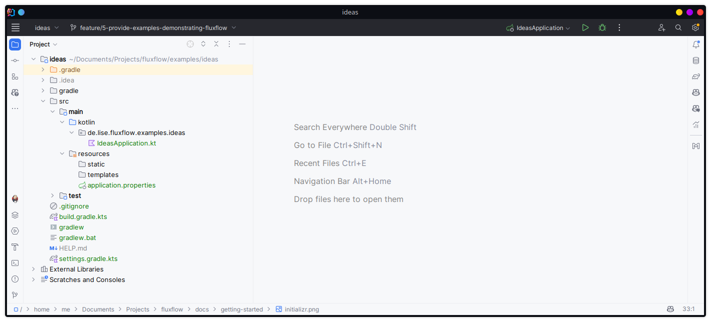

# Getting started

## I. Project setup
During this demonstration, we are going to use the following setup:
- Spring Boot service written in Kotlin
- A dockerized MongoDB instance for persistence
- FluxFlow as our workflow engine

### 1. Initializing a Spring Boot project
You can also download the Spring Boot project template using [this link](https://start.spring.io/#!type=gradle-project-kotlin&language=kotlin&platformVersion=3.2.3&packaging=jar&jvmVersion=17&groupId=de.lise.fluxflow.examples&artifactId=ideas&name=ideas&description=Demonstrating%20FluxFlow%20with%20Spring%20Boot&packageName=de.lise.fluxflow.examples.ideas&dependencies=web,data-mongodb). 


*Creating a Spring Boot project using the Spring Initializr*

1. Go to [Spring Initializr (https://start.spring.io)](https://start.spring.io/)
2. Fill in the following details (adapt as desired):
   - Project: Gradle Project - Kotlin
   - Language: Kotlin
   - Spring Boot: 3.2.3
   - Project Metadata
     - Group: `de.lise.fluxflow.examples`
     - Artifact: `ideas`
     - Name: `ideas`
     - Description: `Demonstrating FluxFlow with Spring Boot`
     - Package name: `de.lise.fluxflow.examples.ideas`
   - Dependencies
     - Spring Web
     - Spring Data MongoDB
3. Click on "Generate" and download the project.
4. Extract the downloaded ZIP file and open it in your favorite IDE.



### 2. Adding FluxFlow to your project
Open the `build.gradle.kts` file and add the following dependencies.

```kotlin
dependencies {
    // Fluxflow dependencies
    implementation("de.lise.fluxflow:springboot:0.1.0") // Core dependency
    implementation("de.lise.fluxflow:mongo:0.1.0") // FluxFlow MongoDB persistence support
    
    // Spring Boot dependencies as generated by the Spring Initializr
    implementation("org.springframework.boot:spring-boot-starter-data-mongodb")
    implementation("org.springframework.boot:spring-boot-starter-web")
    implementation("com.fasterxml.jackson.module:jackson-module-kotlin")
    implementation("org.jetbrains.kotlin:kotlin-reflect")

    // Test dependencies (also generated by the Spring Intializr)
    testImplementation("org.springframework.boot:spring-boot-starter-test")
}
```
*build.gradle.kts*

Refresh your Gradle project to download the new dependencies.

## II. Defining your workflow
In our demo tutorial,
we are going to create an idea management application that can be used to submit new ideas and improvements.

The business process for this application is as follows:

1. An idea is submitted
2. The idea is reviewed and feedback is given
3. The idea is either accepted or rejected
4. If the idea is accepted, it is implemented
5. The idea is closed

### 3. Creating the initial step
Create a new class file `SubmitIdeaStep.kt` and annotate it with `@Step`.

```kotlin
package de.lise.fluxflow.examples.ideas.workflow

import de.lise.fluxflow.stereotyped.step.Step

@Step
class SubmitIdeaStep {
    
}
```

### 4. Defining the first step data
The blank step created during the previous step will be the starting point of our workflow.
During this first step, the user needs to be able to fill in the details about the idea.
Namely, a summary, an author and a description.

Information that is bound to a step is called "step data" and modeled by adding properties to the step class.

```kotlin
package de.lise.fluxflow.examples.ideas.workflow

import de.lise.fluxflow.stereotyped.step.Step
import de.lise.fluxflow.stereotyped.step.data.Data

@Step
class SubmitIdeaStep {
    @Data
    var summary: String = ""
    @Data
    var author: String = ""
    @Data
    var description: String = ""
}
```

### 5. Transitioning to the next step
The next step in our workflow is the review step.
Like before, we create a blank `ReviewIdeaStep` and also annotate it with `@Step`.

```kotlin
package de.lise.fluxflow.examples.ideas.workflow

import de.lise.fluxflow.stereotyped.step.Step

@Step
class IdeaReviewStep {
}
```

In order to transition from the `SubmitIdeaStep` to the `IdeaReviewStep`, we need to create a "step action" within the `SubmitIdeaStep`.
A step action is a method that is declared within a step.
The method might be annotated with `@Action` and its return value controls how the workflow should be continued.

```kotlin
package de.lise.fluxflow.examples.ideas.workflow

import de.lise.fluxflow.stereotyped.step.Step
import de.lise.fluxflow.stereotyped.step.action.Action
import de.lise.fluxflow.stereotyped.step.data.Data

@Step
class SubmitIdeaStep {
    @Data
    var summary: String = ""
    @Data
    var author: String = ""
    @Data
    var description: String = ""
    
    @Action
    fun submit(): IdeaReviewStep {
        return IdeaReviewStep()
    }
}
```

Implicitly, the returned value is assumed to be the next step in the workflow.
In order to explicitly state
that the workflow should be continued with a new step a `Continuation.step` can be returned instead.

```kotlin
package de.lise.fluxflow.examples.ideas.workflow

import de.lise.fluxflow.api.continuation.Continuation
import de.lise.fluxflow.stereotyped.step.Step
import de.lise.fluxflow.stereotyped.step.action.Action
import de.lise.fluxflow.stereotyped.step.data.Data

@Step
class SubmitIdeaStep {
    @Data
    var summary: String = ""
    @Data
    var author: String = ""
    @Data
    var description: String = ""
    
    @Action
    fun submit(): Continuation<IdeaReviewStep> {
        return Continuation.step(IdeaReviewStep())
    }
}
```

### 6. Passing data to the next step
Data can very easily be transferred from one step to the next, by simply passing them as constructor parameters.

```kotlin
package de.lise.fluxflow.examples.ideas.workflow

import de.lise.fluxflow.stereotyped.step.Step

@Step
class IdeaReviewStep(
    val summary: String,
    val author: String,
    val description: String
) {
}
```

```kotlin
package de.lise.fluxflow.examples.ideas.workflow

import de.lise.fluxflow.stereotyped.step.Step
import de.lise.fluxflow.stereotyped.step.action.Action
import de.lise.fluxflow.stereotyped.step.data.Data

@Step
class SubmitIdeaStep {
    @Data
    var summary: String = ""
    @Data
    var author: String = ""
    @Data
    var description: String = ""
    
    @Action
    fun submit(): IdeaReviewStep {
        return IdeaReviewStep(
            summary,
            author,
            description
        )
    }
}
```

## III. Going forward
As of now, we have defined the first two steps of our workflow and demonstrated basic FluxFlow concepts.
This tutorial will soon be continued.
Until then, more information can be found within the general sections of this documentation.
