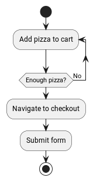

# Steps

In FluxFlow, the concept of a step holds paramount importance. A step
represents a discrete unit of work or an action that is executed within
a workflow. Whether you’re automating business processes, orchestrating
complex tasks, or streamlining operations, understanding and effectively
utilizing steps is vital for creating efficient and robust workflows.


<div class="caption image">Example process (ordering pizza) using basic steps and branching</div>



<!--
[plantuml]
----
@startuml
start

repeat :Add pizza to cart;
repeat while(Enough pizza?) is (No)
:Navigate to checkout;
:Submit form;


stop
@enduml
----
-->

A step serves as a building block of a workflow, defining a specific
task that needs to be performed. It encapsulates the instructions,
dependencies, and conditions required to accomplish a particular action
within the larger workflow. By breaking down complex processes into
smaller, manageable steps, workflow engines enable the systematic
execution of tasks and facilitate efficient coordination among various
components.

Steps within a workflow are designed to be modular and reusable,
allowing for flexibility and adaptability. Each step represents a
logical unit of work, such as data manipulation, decision-making,
integration with external systems, or invoking services. These units can
be combined, reordered, and interconnected to construct powerful and
versatile workflows that automate complex business processes.

When designing a workflow, the selection and arrangement of steps play a
crucial role in achieving desired outcomes. These steps may include
actions like data transformation, conditional branching, error handling,
event triggers, approvals, notifications, and many others.

Steps are not only responsible for executing tasks but also for managing
the flow of control within a workflow. They define the order in which
actions are performed and provide mechanisms to handle exceptions,
handle success or failure scenarios, and handle branching based on
conditions. This control flow management ensures that workflows progress
smoothly, enabling efficient resource utilization, error handling, and
adaptability to changing conditions.

## General

### Rules of steps

Steps always and unambiguously belong to one workflow. Even though a
workflow can have multiple steps, a step can only be associated with one
single workflow.

1.  manipulate their own data

2.  manipulate their workflow’s data

3.  transition to or fork new steps

4.  schedule jobs

5.  call other services

6.  interact with other workflows and steps using the FluxFlow API
    services

<!-- -->

1.  directly manipulate other workflows or steps (without using the
    FluxFlow API)

### Types of steps

Currently, the only supported step type is a stateful step. A stateful
step can have persistent data and define actions, which can be
externally manipulated or invoked.

### Step data

Many workflow steps, especially those performed by users, need some kind
of input. As they are only required for a particular step, these inputs
are called "step data" or "data" for short.

As the name suggests, a step data entry can also be read externally and
therefore be used to export information. In fact, every step data entry
can be read while not everyone can be written externally.

### Step identifiers

A step identifier uniquely identifies a step within its workflow and is
assigned by FluxFlow. Within a given workflow, there will be no steps
sharing a common identifier. However, steps from different workflows are
not guaranteed to have distinct identifiers. In order to globally refer
to a single instance of a step, the combination of the step’s and
workflow’s identifier should be used.

### Step definitions

It is important to distinguish between a step and a step definition.
While both terms are closely related and often used interchangeably,
they refer to different aspects of a workflow.

A step is an instance of an action or task within a workflow. It
represents a specific unit of work that needs to be performed. For
example, a step could involve sending an email, making an API call,
performing a calculation, or executing a decision-making process.

On the other hand, a step definition refers to the blueprint or template
that defines the structure and behavior of a step. It serves as a
reusable definition or configuration for a specific type of step within
a workflow. A step definition typically includes information such as the
input parameters required by the step, the expected output or result,
any dependencies or conditions, and the logic or code associated with
the step.

In essence, a step definition provides the instructions and
specifications for how a step should be executed, while a step
represents the actual occurrence or instantiation of that step within a
workflow.

### Step kinds

Similar to the [step identifier](#_step_identifiers), a step kind
identifies a [step definition](#_step_definitions). As step definitions
are not scoped to a workflow, the step kind is globally unique.

## Defining steps

### Basics

A step can be defined by modelling it as a class.

**Minimal step definition**

    class SubmitPizzaOrderStep {
    }

Even though the `...Step` prefix is not required by FluxFlow, it can
help developers in recognizing that this class is indeed a FluxFlow step
definition.

The `@Step` annotation can be used to define a custom step kind or to
make it absolutely clear, that the annotated class is a step definition.

**Step definition declaring a custom kind `submit-pizza-order`**

    import de.lise.fluxflow.stereotyped.step.Step

    @Step("submit-pizza-order")
    class SubmitPizzaOrderStep {

    }

If the `@Step` annotation is omitted or used without providing a custom
step kind, the classes fully qualified and canonical name will be used.

**Step definition with default kind**

    import de.lise.fluxflow.stereotyped.step.Step

    @Step
    class SubmitPizzaOrderStep {

    }

In order to prevent naming collisions when using custom names, it is
recommended to only assign a custom kind when absolutely needed.

### Adding step data

A step data entry can be easily defined by declaring a property within
the step definition class. The property must be publicly accessible in
order for FluxFlow to pick it up. If the property is read only (`val`),
the resulting step data will be read only too.

Let’s say we want to allow the user to enter his mail address. This can
be archived by adding a mutable string property `mailAddress` (the
property name will become the data’s kind).

**Step definition with simple step data**

    class SubmitPizzaOrderStep {
        var mailAddress: String? = null
    }

We could also define the property using a default constructor, allowing
us to omit the default initialization.

**Step data declared using the primary constructor**

    class SubmitPizzaOrderStep(
        var mailAddress: String?
    ) {
    }

Similar to the `@Step` annotation, the `@Data` annotation can be used to
explicitly mark the property as a step data entry or to define a custom
data kind.

**Step data definition with explizit `@Data` annotation**

    import de.lise.fluxflow.stereotyped.step.data.Data

    class SubmitPizzaOrderStep(
        @Data("mail-address") // or @Data
        var mailAddress: String?
    ) {
    }

It is also possible to add step data that utilizes getter and setters to
dynamically values or to react to modifications.

    class SubmitPizzaOrderStep(
        var mailAddress: String?
    ) {

        val hasMailAddress: Boolean
            get() = mailAddress != null

    }

#### Inactive Modifications
By default, changes to step data are not allowed when the step is no longer active.
There is a global setting `fluxflow.data.allow-inactive-modification` to allow changes to inactive step data.
Furthermore, the global setting can also be overwritten for each StepData using the property `modificationPolicy` in the `@Data` annotation.

```kotlin
class SubmitPizzaOrderStep(
    @Data(modificationPolicy = ModificationPolicy.AllowInactiveModification)
    var mailAddress: String?
)
```

#### Listen for changes

Sometimes it is required to react whenever a certain value changes. The
straight forward approach is to declare a property setter, that checks
if the new value is different from the previous value.

**Straight forward approach on listening for step data changes (don’t do
this)**

    class SubmitPizzaOrderStep {
        private var _mailAddress: String? = null

        // DON'T DO THIS
        var mailAddress: String?
            get() = _mailAddress
            set(value) {
                if (value != _mailAddress) {
                    // Do something
                }
                _mailAddress = value
            }
    }

This approach has a few major drawbacks, and should only be used in rare
circumstances (such as logging).

Whenever FluxFlow needs to activate the above step, the property’s
setter will be invoked in order to restore the previous step state.
Therefore, the setter would always see an initial "update" whenever the
step is getting initialized.

**The preferred way** to react to data changes is to declare a data
listeners. A step data listener is a special (public) step function,
which is annotated with `@DataListener`. It will be invoked whenever the
observed step data actually changes. The annotation itself expects a
string that will refer to the step data to be observed using its step
data kind.

**Example of a basic step data listener**

    class SubmitPizzaOrderStep(
        var mailAddress: String?
    ) {
        @DataListener("mailAddress") // 
        fun onMailAddressChange() {
            // do something // 
        }
    }

-   Registers the `.onMailAddressChange` function as a data listener,
    observing the `mailAddress` step data.

-   Is invoked everytime a different value is assigned to `mailAddress`.

In order to receive the old and updated values, the function can declare
two parameters matching the data’s type.

**Example of a step data listener receiving the origin and updated
values**

    class SubmitPizzaOrderStep(
        var mailAddress: String?
    ) {
        @DataListener("mailAddress")
        fun onMailAddressChange(
            oldValue: String?, // 
            newValue: String? // 
        ) {
            Logger.info("Mail address changed from {} to {}", oldValue, newValue)
        }

        private companion object {
            val Logger = LoggerFactory.getLogger(SubmitPizzaOrderStep::class.java)!!
        }
    }

-   Will be assigned to the pre-update value

-   Will be assigned to the new/updated value

Be sure that the parameter is always assignable from the actual value
types. Also consider nullability - if the step data is nullable, the
parameters must be nullable as well.

FluxFlow will determine which parameter receives the old and which one
receives the updated value by reflecting on their names and positions.
Parameters having a name containing "old" or "original" will receive the
pre-update value, while parameters with "new" or "updated" in their name
will receive the new value. If the names do not match, the parameter
order is consulted. Whereas the first assignable parameter will always
receive the old value, while the second one will receive the updated
value.

In order to listen for multiple step data changes, the annotation can be
repeated for different step data kinds. Within the step data listener
you may distinguish them, by defining a `DataKind` parameter. This
parameter will receive the `DataKind` object describing the step data
that changed.

**Listening for different step data changes having the same type**

    class SubmitPizzaOrderStep(
        var mailAddress: String?,
        var alternativeMailAddress: String?
    ) {
        @DataListener("mailAddress")
        @DataListener("alternativeMailAddress")
        fun onMailAddressChange(
            dataKind: DataKind, // 
            oldValue: String?,
            newValue: String?
        ) {
            Logger.info("{} changed from {} to {}", dataKind, oldValue, newValue)
        }

        private companion object {
            val Logger = LoggerFactory.getLogger(SubmitPizzaOrderStep::class.java)!!
        }
    }

-   The `dataKind` will contain the kind of the step data that changed.

Be extra cautious when listening for changes of different types, as the
listener function’s parameters must be assignable from all observed step
data types.

**Listening for different step data changes having different types**

    class SubmitPizzaOrderStep(
        var mailAddress: String?,
        var postalAddress: Address?
    ) {
        @DataListener("mailAddress")
        @DataListener("postalAddress")
        fun onMailAddressChange(
            dataKind: DataKind,
            oldValue: Any?,
            newValue: Any?
        ) {
            Logger.info("{} changed from {} to {}", dataKind, oldValue, newValue)
        }

        private companion object {
            val Logger = LoggerFactory.getLogger(SubmitPizzaOrderStep::class.java)!!
        }
    }

You can also declare additional parameters which will be resolved using
dependency injection.

#### Continuing the workflow on data changes

[Data listeners](#step_data_listen_for_changes) can also return a
`Continuation`, that can be used to control the workflow’s execution.

For more details regarding continuations, see [Continuing the workflow
using return values](#step_action_continuation).

### Definition of metadata

Step definitions can have an arbitrary set of key-value pairs, that can
be used to provide additional context. Metadata is considered to be
static information on a step or its definition.

Step definition metadata is exposed using `Step.definition.metadata`.
This property holds a map that is never null and contains a mapping for
arbitrary keys to some values. A value associated with a key is
guaranteed to always be non-null.

#### Customizing metadata entries
The metadata will automatically be obtained from annotations that have
been applied to a step’s definition.
All annotations that shall be used as a metadata source must themselves be meta-annotated with `@Metadata`.

By default, metadata keys are implicitly obtained using the logic
described by the following listing.

Implicit logic for obtaining metadata key-values

If the applied annotation has

1.  no property
    1. `key`: the key as specified within the `@Metadata` annotation; 
    2. `value`: static value of `true`
2.  a single property
    1. `key`: the key as specified within the `@Metadata` annotation; 
    2. `value`: the property’s value
3.  more than one property
    1. `key`: the key as specified within the `@Metadata` annotation + `"."` + the property’s name;
    2. `value`: the property’s value

**Creation and usage of a metadata annotation**
```kotlin
import de.lise.fluxflow.stereotyped.metadata.Metadata

@Metadata("displayName")
annotation class DisplayName(
    val name: String
)

@DisplayName("Complete order")
class CompleteOrderStep {
    // actual step implementation
}
```
    
It is also possible to customize the property name that will be used in case of annotations having
multiple properties.
To do so, the `@Metadata` meta-annotation can be applied to the annotation’s property using `@get:Metadata`.

**Example of applying `@Metadata` to properties**

```kotlin
@Metadata("displayName")
annotation class DisplayName(
    @get:Metadata("long")
    val longName: String,
    @get:Metadata("short")
    val shortName: String
)
```
If at least on property is annotated with `@Metadata`, all
other unannotated properties will be ignored.

## Actions

A step can define on or more actions. An action hereby represents
functionality, that can be invoked on that step. As such, actions are
modeled by declaring functions within the step definition class.

Invoking an action is normally considered to be step-completing. After
an action completed successfully, the owning step is therefore going to
have the `Completed` status.

If automatic step completion is not desired, refer to section
[Non-completing actions](#step_action_non_completing).

### Basic actions

Each step function (except those inherited from `Object` or `Any`) are
considered as an Action as long as they fulfill the following
prerequisites.

1.  The function’s visibility is public

2.  The function is not abstract

3.  The function is not static

4.  If the function is

    1.  not annotated with `@Action`, it does not require parameters

    2.  annotated with `@Action`, it requires only injectable parameters

Therefore, a basic action definition could look like the one shown
below.

**Basic step action**

    class SubmitPizzaOrderStep {
        fun submit() {
            // send notification to the restaurant
        }
    }

In order to distinguish between multiple actions, the function’s name is
used as the action’s kind. If a function should not be considered as an
action or the action’s kind should be set explicitly, the `@Action`
annotation can be used.

As soon as a function is explicitly marked as an action (using the
`@Action` annotation), the implicit discovery will be disabled.

**Possible use cases for explicit `@Action` declarations**

    @Step
    class SubmitPizzaOrderStep {
        @Action // 
        fun submit() { /* ... */ }

        @Action("cancel-order") // 
        fun cancel() { /* ... */ }

        fun iAmNotAStep() { /* ... */ } // 
    }

-   This explicitly marks the annotation function to be treated as a
    step action. All other functions are now ignored, as long as they
    are not also explicitly annotated.

-   In this example, the action’s kind will be explicitly set to
    "cancel-order".

-   This function will not be treated as an action, even though it would
    satisfy all requirements. This is because implicit discovery has
    been disabled, as this step has at least one explicitly annotated
    function.

### Injection into action functions

As mentioned in [orderedlist\_title](#step_action_requirements), it is
possible to inject additional dependencies using an action function’s
parameters.

Currently, injection is only supported for values that can be obtained
from the IoC container.

If an action function requires additional parameters, it **must** be
annotated with `@Action`.

This feature is especially useful if your step action needs to invoke
external (stateless) functionality, which is only required for a
specific action. Adding such a dependency using a constructor parameter
would still be possible, but might complicate creating new instances of
that step.

The following two examples demonstrate the problem that can arise if
stateless dependencies are injected using constructor parameters and how
this can be solved using action parameter injection.

**Example of dependencies obtained from constructor injection**

    @Service
    class MailService { // 
        fun sendMail(receiver: String, message: String) {}
    }

    @Step
    class CompleteOrderStep(
        val customerMailAddress: String,
        private val mailService: MailService // 
    ) {
        @Action
        fun completeOrder() {
            mailService.sendMail(customerMailAddress, "Thank you for your order") // 
        }
    }

    @Step
    class ReviewShoppingCart(
        val customerMailAddress: String,
        private val mailService: MailService // 
    ) {
        @Action
        fun proceedToCheckout(): CompleteOrderStep {
            return CompleteOrderStep(
                customerMailAddress,
                mailService // 
            )
        }
    }

-   The mail service provides external functionality, which is
    independent of a workflow’s current state.

-   The step that completes an ordering process requires this
    functionality to send an order summery.

-   Technically, this external dependency could be accessed using
    constructor parameter injection.

-   However, since we might need to create instances of that step when
    transitioning into it, we are therefore required to provider an
    actual value for that constructor parameter.

-   This forces upstream steps to also declare `MailService` as a
    dependency.

This problem can be avoided, by directly injecting the `@MailService`
into the `completeOrder` action.

**Functionally identical workflow that uses action parameter injection**

    @Service
    class MailService {
        fun sendMail(receiver: String, message: String) {}
    }

    @Step
    class ReviewShoppingCart(
        val customerMailAddress: String
    ) {
        @Action
        fun proceedToCheckout(): CompleteOrderStep {
            return CompleteOrderStep(customerMailAddress)
        }
    }

    @Step
    class CompleteOrderStep(
        val customerMailAddress: String
    ) {
        @Action
        fun completeOrder(mailService: MailService) {
            mailService.sendMail(customerMailAddress, "Thank you for your order")
        }
    }

### Continuing the workflow using return values

A step action can use the returned value to control the future workflow
behavior.

<table>
<caption>Possible ways of continuing a workflow after a step action has
been executed</caption>
<colgroup>
<col style="width: 12%" />
<col style="width: 37%" />
<col style="width: 25%" />
<col style="width: 25%" />
</colgroup>
<tbody>
<tr class="odd">
<td style="text-align: left;"><p><strong>Type</strong></p></td>
<td style="text-align: left;"><p>Description</p></td>
<td style="text-align: left;"><p>Explizit</p></td>
<td style="text-align: left;"><p>Implicit</p></td>
</tr>
<tr class="even">
<td style="text-align: left;"><p><strong><a
href="#step_action_continuation_step">Step
continuation</a></strong></p></td>
<td style="text-align: left;"><p>A step continuation indicates that the
workflow should be continued with a new step.</p></td>
<td style="text-align: left;"><p>Returning
<code>Continuation.job()</code>.</p></td>
<td style="text-align: left;"><p>Returning an instance of a job
definition.</p></td>
</tr>
<tr class="odd">
<td style="text-align: left;"><p><strong><a
href="#step_action_continuation_noop">No-op
continuation</a></strong></p></td>
<td style="text-align: left;"><p>A no-op continuation indicates that no
further operations should be performed.</p></td>
<td style="text-align: left;"><p>Returning
<code>Continuation.none()</code></p></td>
<td style="text-align: left;"><p>Returning nothing (e.g. declaring a
<code>void</code> function)</p></td>
</tr>
<tr class="even">
<td style="text-align: left;"><p><strong><a
href="#step_action_continuation_job">Job
continuation</a></strong></p></td>
<td style="text-align: left;"><p>A job continuation indicates that the
workflow should schedule a new job, which gets executed at a specified
time.</p></td>
<td style="text-align: left;"><p>Returning
<code>Continuation.job()</code></p></td>
<td style="text-align: left;"><p>-</p></td>
</tr>
<tr class="odd">
<td style="text-align: left;"><p><strong><a
href="#step_action_continuation_cancel_jobs">Cancel jobs
continuation</a></strong></p></td>
<td style="text-align: left;"><p>A cancel jobs continuation indicates
that FluxFlow should cancel previously scheduled jobs without replacing
them with new jobs.</p></td>
<td style="text-align: left;"><p>Returning
<code>Continuation.cancelJobs</code></p></td>
<td style="text-align: left;"><p>-</p></td>
</tr>
<tr class="even">
<td style="text-align: left;"><p><strong><a
href="#step_action_continuation_multiple">Multiple
continuation</a></strong></p></td>
<td style="text-align: left;"><p>A multiple continuation indicates that
the workflow should continue with multiple continuations at the same
time.</p></td>
<td style="text-align: left;"><p>Returning
<code>Continuation.multiple()</code></p></td>
<td style="text-align: left;"><p>-</p></td>
</tr>
<tr class="odd">
<td style="text-align: left;"><p><strong><a
href="#step_action_continuation_rollback">Rollback
continuation</a></strong></p></td>
<td style="text-align: left;"><p>A rollback continuation indicates that
the previous step should be reactivated while (by default) canceling the
current one.</p></td>
<td style="text-align: left;"><p>Returning
<code>Continuation.rollback()</code></p></td>
<td style="text-align: left;"><p>-</p></td>
</tr>
<tr class="even">
<td style="text-align: left;"><p><strong><a
href="#step_action_continuation_workflow">Workflow
continuation</a></strong></p></td>
<td style="text-align: left;"><p>A workflow continuation indicates the
FluxFlow should start a new workflow.</p></td>
<td style="text-align: left;"><p>Returning
<code>Continuation.workflow()</code></p></td>
<td style="text-align: left;"><p>-</p></td>
</tr>
</tbody>
</table>

Possible ways of continuing a workflow after a step action has been
executed

#### Step continuation

A step continuation continues the current workflow by executing the
specified step.

**Example of continuing a workflow with a new step using explicit or
implicit declarations**

    class SubmitPizzaOrderStep {
        fun submitImplicit(): CompleteOrderStep { // 
            return CompleteOrderStep()
        }

        fun submitExplicit(): Continuation<CompleteOrderStep> { // 
            return Continuation.step(CompleteOrderStep())
        }
    }

    class CompleteOrderStep

-   Continue with a `CompleteOrderStep` by returning its definition.

-   Continue with a `CompleteOrderStep` by returning an explicit
    continuation.

#### No-op continuation

If an action function is defined as a void method or returns a
`Continuation.none()`, no further operations will be performed.

**Completing a step without triggering new operations**

    class CompleteOrderStep {
        fun completeImplicit() {} // 
        fun completeExplicit(): Continuation<*> { // 
            return Continuation.none()
        }
    }

-   Actions returning nothing will trigger no additional operations.

-   This is equivalent to returning a `Continuation.none()`.

#### Job continuation

See [???](#_jobs).

#### Cancel jobs continuation

See [???](#_jobs)

#### Multiple continuation

A "multiple continuation" can be used if the workflow should continue
with more than one operation at the same time.

    class NotifyCustomerStep { /* ... */ }
    class NotifyRestaurantStep { /* ... */ }

    class SubmitPizzaOrderStep {
        fun submit(): Continuation<*> {
            return Continuation.multiple( // 
                Continuation.step(NotifyCustomerStep()), // 
                Continuation.step(NotifyRestaurantStep())
            )
        }
    }

-   Create individual continuations that should be executed after this
    action

-   and wrap them within `Continuation.multiple`.

#### Rollback continuation

A "rollback continuation" can be used to restore the previous step. If
such continuation is returned, FluxFlow will try to determine the
previous step and reactive it if necessary. The "previous step" is
hereby defined as the step that created the currently executing workflow
object.

    class ModifyBasketStep {
        // ...

        fun processToCheckout(): SubmitPizzaOrderStep {
            return SubmitPizzaOrderStep() // 
        }

    }

    class SubmitPizzaOrderStep {
        fun submit() {
            // do actual checkout
        }

        fun cancel(): RollbackContinuation {
            return Continuation.rollback<ModifyBasketStep>() // 
        }
    }

-   The `processToCheckout` action will start a new
    `SubmitPizzaOrderStep` and is completed afterward.

-   Whenever the `cancel` action within the `SubmitPizzaOrderStep` is
    invoked, FluxFlow will search for the previous step (in this case
    being the `ModifyBasketStep`) and reactivate it.

It is the developer’s responsibility to make sure that there actually is
a previous step. Otherwise, a `InvalidContinuationException` will be
thrown.

The rollback annotation will not do anything other than reactivating the
previous step. This is especially true for any changes and actions that
have been run before the rollback.

The generic parameter of `Continuation.rollback<TPreviousStep>` serves
no other purpose than being a hint to the developer. It can be used to
indicate what the previous step might have been and to enable an IDE’s
"find usages"-feature.

If the previous step kind may vary or is unknown, the type wildcards
(`*` or `?`) might be used.

The rollback continuation will (by default) cancel the currently
executing step. In order to keep the current step active as well, either
set the `@Action(statusBehavior=...)` annotation or explicitly specify
the continuation’s status behavior.

    @Action(statusBehavior = ImplicitStatusBehavior.Preserve)
    fun cancel(): Continuation<*> {
        return Continuation.rollback<ModifyBasketStep>()
            .withStatusBehavior(StatusBehavior.Preserve)
    }

#### Workflow continuation

A "workflow continuation" can be used to start an entirely new workflow.
The current workflow can either be continued normally or be removed once
the new workflow started, depending on the specified `ForkBehavior`.

    class SubmitPizzaOrderStep {
        fun submit(): Continuation<*> {
            val feedback = CustomerFeedback()
            return Continuation.workflow( // 
                feedback,
                Continuation.step(feedback)
            )
        }
    }

    class CustomerFeedback {/** ...**/ }

    class AskForFeedbackStep(
        feedback: CustomerFeedback
    ) {
        /** ... **/
    }

-   Starts the `AskForFeedbackStep` within a new workflow having its own
    workflow model (`CustomerFeedback`).

By default, the current workflow is continued normally. This can either
be specified explicitly or changed, using on of the following methods.

    fun submit(): Continuation<*> {
        val workflowModel = CustomerFeedback()
        val initialStep = Continuation.step(AskForFeedbackStep(workflowModel))

        val defaultBehavior = Continuation.workflow(workflowModel, initialStep)

        val explicitFork = Continuation.workflow(workflowModel, initialStep, ForkBehavior.Fork)
        val explicitForkFromBuilder = Continuation.workflow(workflowModel, initialStep)
            .withForkBehavior(ForkBehavior.Fork)

        val explicitRemove = Continuation.workflow(workflowModel, initialStep, ForkBehavior.Remove)
        val explicitRemoveFromBuilder = Continuation.workflow(workflowModel, initialStep)
            .withForkBehavior(ForkBehavior.Remove)

        return defaultBehavior
    }

### Non-completing actions

A step is marked as being `Completed` once an action has been
successfully executed. However, it is possible to change this behavior
if the step should remain in its state after an action ran.

This can be done in one of the following ways, demonstrated by the
example below.

    class CompleteOrderStep

    class SubmitPizzaOrderStep { // 
        @Action(statusBehavior = ImplicitStatusBehavior.Preserve)
        fun printSummary() {
            // do work
        }

        @Action(statusBehavior = ImplicitStatusBehavior.Complete)
        fun complete(): CompleteOrderStep {
            return CompleteOrderStep()
        }
    }

    class SubmitPizzaOrderStep { // 
        fun printSummary(): Continuation<*> {
            // do work
            return Continuation.none()
                .withStatusBehavior(StatusBehavior.Preserve)
        }

        fun complete(): Continuation<CompleteOrderStep> {
            return Continuation.step(CompleteOrderStep())
                .withStatusBehavior(StatusBehavior.Complete)
        }
    }

-   The first example shows how the automatic step completion can be
    controlled using the `@Action` annotation.

-   The second implementation behaves the same, while using explicitly
    returned continuations.

All status behaviors declared using the `@Action` annotation (except
`ImplicitStatusBehavior.Default`), will override behaviors specified by
explicitly returned continuations.

### Adding metadata to actions

Like steps and step definitions, an action can also have metadata
attached to it. To do so, simply apply the relevant annotations to the
action function in question.

**Example of an annotated action function**

    annotation class DisplayName(name: String)

    @Step
    class CompleteOrderStep {

        @Action
        @DisplayName("Complete your order") // 
        fun completeOrder() {

        }
    }

-   The action will have a metadata entry of
    `displayName="Complete your order"`

In order to access an action’s metadata, the
`Action.definition.metadata` property can be used.

Refer to section [Definition of metadata](#step_definition_of_metadata)
for more information on how metadata works and how the generated
metadata can be customized.

## Using steps

### Modifying step metadata at runtime
In order to dynamically modify a step's metadata,
the `StepService.setMetadata(step: Step, key: String, value: Any?)` function can be used.
Metadata set using this function will overwrite or extend any statically defined metadata
(see [Definition of metadata](#definition-of-metadata)).

Existing metadata can be removed by passing a `null` value into the `setMetadata` function
or using the `StepService.removeMetadata(step: Step, key: String)` alias.

```kotlin
import de.lise.fluxflow.api.step.Step
import de.lise.fluxflow.api.step.StepService

class UserTaskService(
    private val stepService: StepService
) {
    fun assignUsers(step: Step, userIds: List<String>) {
        stepService.setMetadata(step, ASSIGNED_USERS_KEY, userIds)
    }
    
    fun clearAssignedUsers(step: Step) {
        stepService.removeMetadata(step, ASSIGNED_USERS_KEY)
    }
    
    private companion object {
        const val ASSIGNED_USERS_KEY = "assignedUsers"
    }
}
```